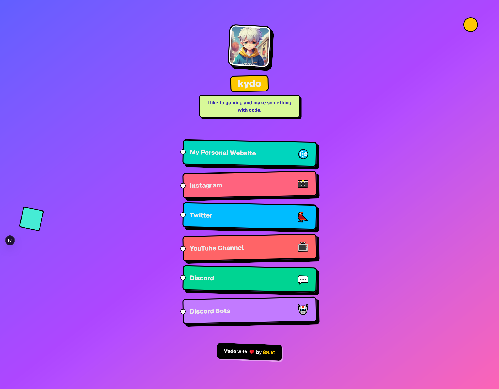

# 🌳 Bio Kydo V2

This is a simple Bio Links Display like Linktree.

---

## 📸 Screenshot
Landing Page

 

---

## 📝 Installation

1. Clone the repository:
```bash
git clone https://github.com/88JC/bio-kydo-v2.git
cd bio-kydo-v2
```

2. Install the dependencies:
```bash
npm install
# or
yarn install
# or
pnpm install
# or
bun install
```

## 🚀 Getting Started

First, run the development server:

```bash
npm run dev
# or
yarn dev
# or
pnpm dev
# or
bun dev
```

Open [http://localhost:3000](http://localhost:3000) with your browser to see the result.

---
## 🤝 Contributing

Contributions are welcome! Please feel free to submit a pull request.

1. Fork the repository
2. Create a new branch
3. Make your changes
4. Commit your changes
5. Push your changes
6. Submit a pull request

---

## 📝 License

This project is open-sourced under the MIT License - see the [LICENSE](LICENSE) file for details.

---

## 📝 Author

This project is created by [88JC](https://github.com/88JC)
